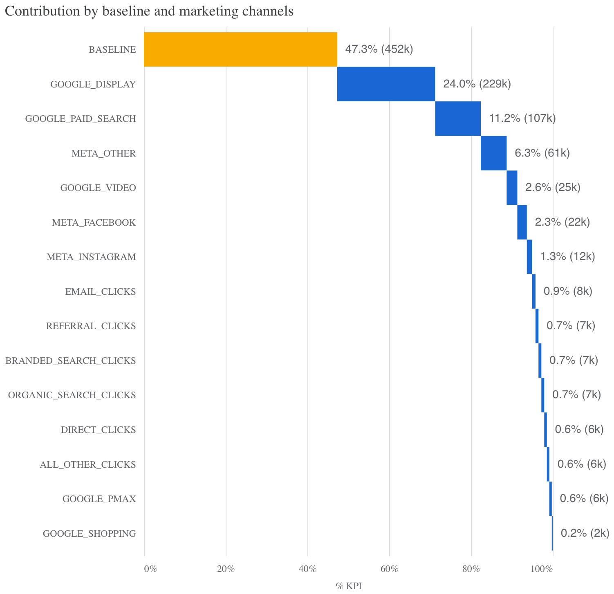

# 🧠 Marketing Mix Modeling with Google Meridian

This project uses **Google Meridian** to run a probabilistic Marketing Mix Model (MMM), optimizing marketing spend across channels using Bayesian inference. The analysis uncovers channel contributions, response curves, and budget reallocation strategies.



---

## 📁 Files in This Repository

| File             | Description |
|------------------|-------------|
| `Notebook.ipynb` | Main Colab notebook for loading data, building MMM, sampling priors/posteriors, and generating visuals |
| `mix.png`        | Contribution breakdown of baseline and channels |
| `prediction.png` | Response curves for top 7 marketing channels |
| `README.md`      | Project documentation (this file) |
| `data.csv`       | Raw data |

---

## 🧩 Project Overview

- **Objective**: Quantify the incremental impact of marketing channels and simulate return curves for budget optimization.
- **Tool**: [Google Meridian](https://github.com/google/meridian) – a Bayesian modeling library for MMM.
- **Data**: Daily marketing performance data with KPIs, spend, impressions, and channel-specific metrics.
- **Scope**: Focused on UK + US campaigns with population-aware modeling.

---

## 📊 Key Results

### Channel Contribution
- **Baseline** accounts for **47.3%** of performance (452k KPI units)
- Top Paid Channels:
  - `GOOGLE_DISPLAY`: **24.0%** (229k)
  - `GOOGLE_PAID_SEARCH`: **11.2%** (107k)
  - `META_OTHER`: **6.3%** (61k)

### Response Curves
- Google Display shows the steepest and most scalable growth potential.
- Google Paid Search is nearing saturation.
- Meta channels show early diminishing returns.

---

## 🧪 Modeling Pipeline

1. **Data Loading & Preprocessing**
   - Merges media, spend, population, and controls
   - Currency normalization and NaN handling

2. **Model Building**
   - Defined with KPIs, media, revenue-per-KPI, controls, and population
   - Channels mapped using `CoordToColumns`

3. **Sampling**
   - Prior sampling for parameter initialization
   - Posterior MCMC sampling for inference

4. **Visualization**
   - Contribution waterfall
   - Response curves and saturation detection
   - Budget optimization (optional in extension)

---

## 📌 How to Run

```python
# Load Notebook.ipynb in Google Colab
# Make sure to install meridian before running:
!pip install git+https://github.com/google/meridian.git
